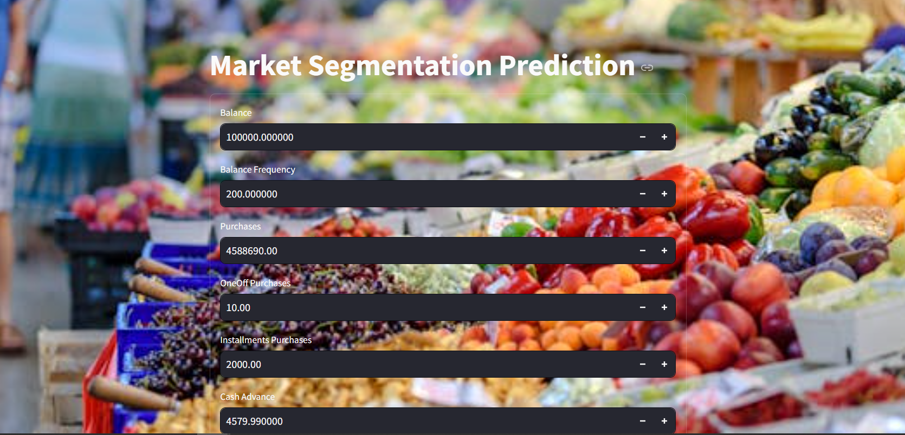
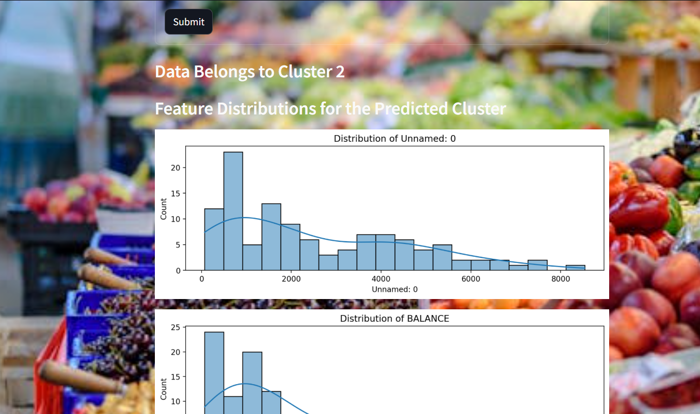
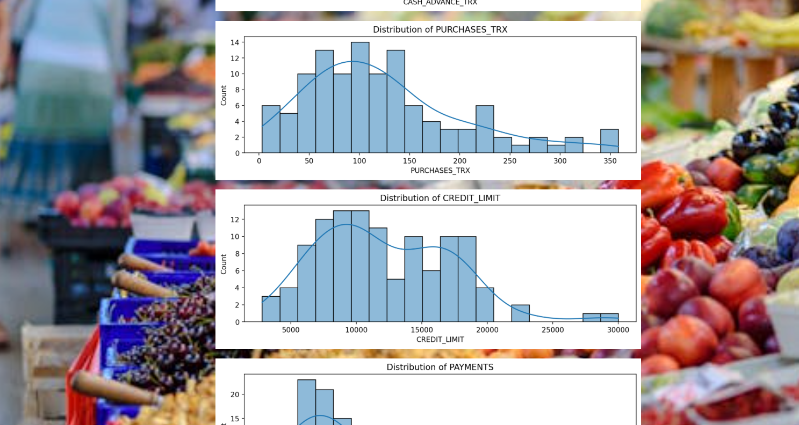

# 🧠 Market Segmentation using K-Means Clustering

This project focuses on applying **K-Means Clustering** to segment customers based on their purchasing behavior and demographic features. It helps businesses understand their customer base and tailor marketing strategies effectively.

## 📌 Objective

To group customers into distinct clusters based on features such as annual income, spending score, and age, enabling better market targeting and decision-making.

## 🛠 Tools & Technologies

- **Python**
- **Scikit-learn**
- **Pandas**, **NumPy**
- **Matplotlib**, **Seaborn**
- **Jupyter Notebook**

## 📁 Project Structure

Market-Segmentation-Project/
├── .ipynb_checkpoints/
├── images/ # Contains visualizations (e.g., elbow plot, cluster plot)
├── marketsegmentation_project/ # (Optional submodules or extra logic)
├── Customer Data.csv # Dataset used for clustering
├── MARKET_SEGEMENTATION.ipynb # Jupyter Notebook with full analysis and model
├── kmeans_model.pkl # Saved KMeans model (for deployment/reuse)
└── README.md # Project documentation

## 📊 Steps Performed

1. **Data Exploration**  
   - Loaded and inspected the customer data  
   - Visualized feature distributions and relationships

2. **Preprocessing**  
   - Handled missing values (if any)  
   - Normalized/selected relevant features for clustering

3. **Modeling with K-Means**  
   - Determined optimal number of clusters using the **Elbow Method**  
   - Applied **K-Means algorithm** to group customers

4. **Evaluation and Visualization**  
   - Visualized clusters using scatter plots  
   - Analyzed the characteristics of each cluster  

5. **Model Saving**  
   - Exported the trained model using `joblib` for future predictions

## 📈 Sample Output

- Optimal number of clusters found using the elbow method
- Clear segmentation of customers into 3–5 clusters based on selected features

 *(If available)*

## 🔄 Future Improvements

- Apply PCA for dimensionality reduction before clustering
- Integrate with a web dashboard for real-time clustering
- Compare performance with other clustering algorithms like DBSCAN or Agglomerative Clustering

## 📄 License

This project is open-source under the MIT License. See the LICENSE file for more details.

---

Let me know if you'd like me to generate this as an actual `README.md` file you can download or edit.

